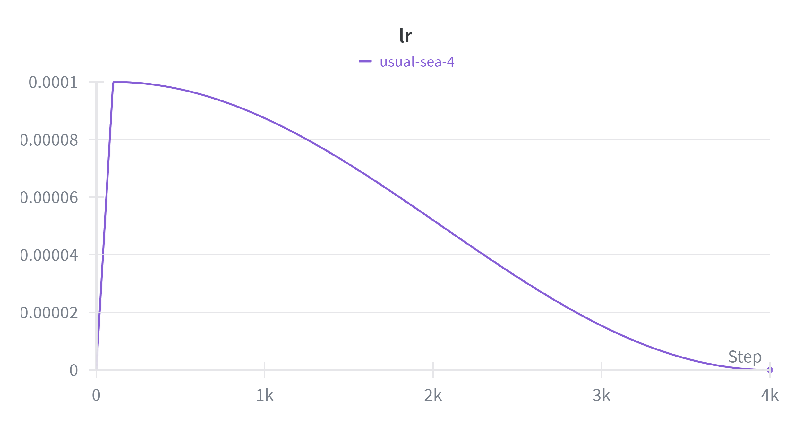
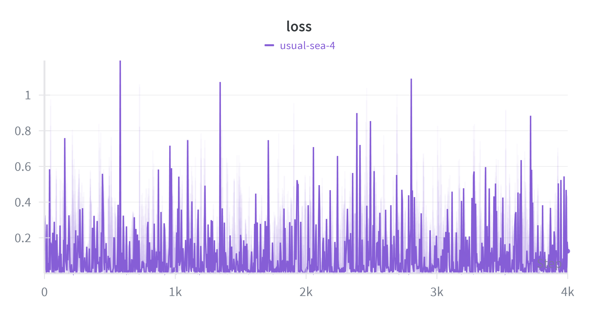
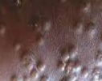
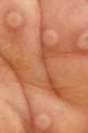
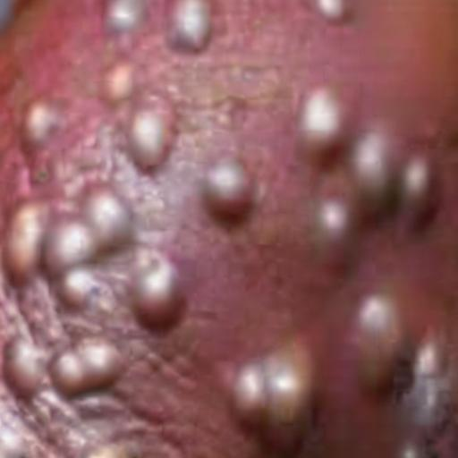
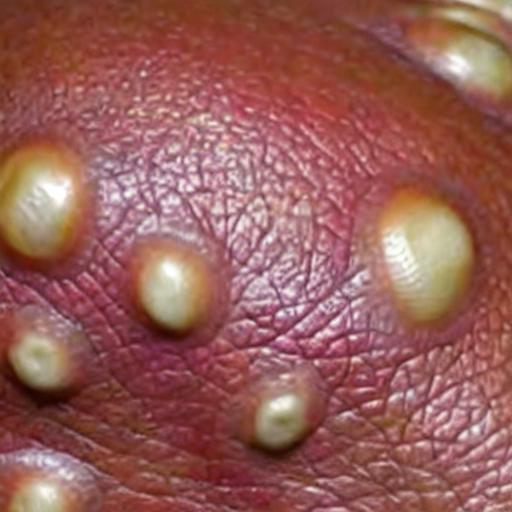
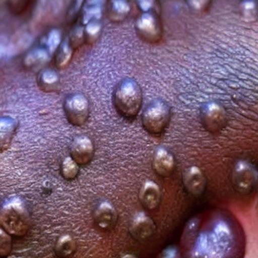

# Mpox Synthetic Image Generation using Stable Diffusion LoRA

A deep learning project for generating high-quality synthetic monkeypox (mpox) skin lesion images using Stable Diffusion fine-tuned with Low-Rank Adaptation (LoRA) for medical data augmentation.

## 📋 Table of Contents

- [Overview](#overview)
- [Technical Stack](#technical-stack)
- [Project Structure](#project-structure)
- [Installation](#installation)
- [Usage](#usage)
  - [1. Data Augmentation](#1-data-augmentation)
  - [2. Training LoRA Model](#2-training-lora-model)
  - [3. Generating Synthetic Images](#3-generating-synthetic-images)
  - [4. Evaluation](#4-evaluation)
- [Technical Details](#technical-details)
- [Metrics](#metrics)
- [Hardware Requirements](#hardware-requirements)
- [Results](#results)
- [License](#license)

---

## 🔬 Overview

This project addresses the challenge of limited medical imaging datasets for monkeypox diagnosis by generating synthetic medical images using generative AI. The pipeline includes:

1. **Data augmentation** - Traditional computer vision augmentation using Albumentations
2. **LoRA fine-tuning** - Fine-tuning Stable Diffusion v1.5 using DreamBooth with LoRA
3. **Synthetic generation** - Generating high-quality synthetic mpox lesion images
4. **Quality evaluation** - Computing FID and SSIM metrics to validate generation quality

The approach leverages parameter-efficient fine-tuning (PEFT) through LoRA, requiring significantly less computational resources and training time compared to full model fine-tuning while maintaining high-quality outputs.

---

## 🛠 Technical Stack

### Core Frameworks
- **PyTorch 2.9.0** (CUDA 12.8) - Deep learning framework
- **Diffusers 0.30.0+** - Hugging Face's diffusion models library
- **PEFT (Parameter-Efficient Fine-Tuning)** - LoRA implementation
- **Transformers** - CLIP text encoder and tokenizer
- **Accelerate** - Distributed training and mixed precision

### Computer Vision
- **torchvision 0.24.0** - Image transformations and Inception-v3 for FID
- **Albumentations** - Advanced image augmentation pipeline
- **OpenCV (cv2)** - Image I/O and preprocessing
- **Pillow** - Image loading and manipulation

### Training Infrastructure
- **Weights & Biases (wandb)** - Experiment tracking and visualization
- **8-bit Adam optimizer** (bitsandbytes) - Memory-efficient optimization
- **Gradient checkpointing** - Reduced memory footprint during training

### Metrics & Evaluation
- **Inception-v3** - Feature extraction for FID calculation
- **SciPy** - Statistical computations for Fréchet distance
- **Custom SSIM implementation** - Structural similarity evaluation

### Environment Management
- **uv** - Fast Python package manager
- **CUDA 12.8** - GPU acceleration

---

## 📁 Project Structure

```
mpox-dm/
├── main.py                      # Entry point (placeholder)
├── augment_mpox.py             # Traditional data augmentation script
├── generate_synth.py           # LoRA-based synthetic image generation
├── evaluate_only.py            # Standalone metrics evaluation
├── requirements.txt            # Python dependencies
├── pyproject.toml             # Project configuration (uv)
│
├── dataset/                    # Original mpox images (400+ images)
│   └── *.jpg, *.png           # Raw medical images
│
├── sd_train/
│   └── train_dreambooth_lora.py  # DreamBooth LoRA training script
│
├── mpox-sd15-lora/
│   ├── weights-sd15-mpox/      # Trained LoRA weights
│   │   ├── pytorch_lora_weights.safetensors  # Final model
│   │   └── checkpoint-*/       # Intermediate checkpoints (1000-4000 steps)
│   └── synth/                  # Generated synthetic images
│
├── metrics/
│   ├── __init__.py
│   ├── fid.py                  # Fréchet Inception Distance
│   └── ssim.py                 # Structural Similarity Index
│
└── wandb/                      # Training logs and metrics
    └── run-*/
        ├── files/
        │   ├── config.yaml     # Training hyperparameters
        │   └── media/images/   # Validation samples
        └── logs/
```

---

## 💾 Installation

### Prerequisites
- Python 3.11+
- CUDA-capable GPU (recommended: 24GB+ VRAM for training)
- CUDA 12.8 installed
- Git

### Setup

1. **Clone the repository**
```bash
git clone https://github.com/nismafaaa/monkeypox.git
cd mpox-dm
```

2. **Install dependencies using uv** (recommended)
```bash
# Install uv if not already installed
curl -LsSf https://astral.sh/uv/install.sh | sh

# Create virtual environment and install dependencies
uv sync
source .venv/bin/activate  # On Linux/Mac
```

**Alternative: Using pip**
```bash
python -m venv .venv
source .venv/bin/activate
pip install -r requirements.txt
```

3. **Install additional dependencies for augmentation**
```bash
pip install albumentations opencv-python-headless
```

4. **Install Diffusers and training dependencies**
```bash
pip install diffusers[torch] accelerate peft transformers wandb bitsandbytes scipy
```

5. **Login to Weights & Biases** (optional, for training tracking)
```bash
wandb login
```

---

## 🚀 Usage

### 1. Data Augmentation

Apply traditional computer vision augmentations to expand the dataset:

```bash
python augment_mpox.py
```

**Configuration** (edit in script):
- `SRC_DIR`: Source directory with original images (default: `~/mpox-dataset`)
- `DST_DIR`: Destination for augmented images (default: `~/mpox-augmented`)
- `AUG_PER_IMAGE`: Number of augmented variants per image (default: 5)

**Augmentation pipeline**:
- Random flips (horizontal/vertical)
- Rotation (±15°)
- Scale and shift transformations
- Color jittering (brightness, contrast, saturation)
- Gaussian noise and blur
- Elastic transformations
- CLAHE (Contrast Limited Adaptive Histogram Equalization)

**Output**: All images resized to 512×512 and saved as JPEG with 95% quality.

---

### 2. Training LoRA Model

Fine-tune Stable Diffusion v1.5 on mpox images using DreamBooth with LoRA:

```bash
accelerate launch sd_train/train_dreambooth_lora.py \
  --pretrained_model_name_or_path="runwayml/stable-diffusion-v1-5" \
  --instance_data_dir="./dataset" \
  --output_dir="./mpox-sd15-lora/weights-sd15-mpox" \
  --instance_prompt="clinical photo of a monkeypox skin lesion" \
  --resolution=512 \
  --train_batch_size=1 \
  --gradient_accumulation_steps=4 \
  --learning_rate=1e-4 \
  --lr_scheduler="cosine" \
  --lr_warmup_steps=100 \
  --max_train_steps=4000 \
  --checkpointing_steps=1000 \
  --rank=8 \
  --use_8bit_adam \
  --gradient_checkpointing \
  --report_to="wandb" \
  --validation_prompt="clinical photo of a monkeypox skin lesion" \
  --num_validation_images=4 \
  --validation_epochs=5
```

**Key Training Parameters**:
- **Model**: Stable Diffusion v1.5 (runwayml)
- **LoRA Rank**: 8 (parameter efficiency vs. expressiveness trade-off)
- **Batch Size**: 1 (effective batch size: 4 with gradient accumulation)
- **Learning Rate**: 1e-4 with cosine annealing
- **Training Steps**: 4000 (checkpoints every 1000 steps)
- **Optimizations**:
  - 8-bit Adam optimizer (reduces memory)
  - Gradient checkpointing (trades compute for memory)
  - Mixed precision training (bfloat16/float16)

**Hardware Used**:
- GPU: 3× NVIDIA L40 (48GB VRAM each)
- Training time: ~2-3 hours for 4000 steps

---

### 3. Generating Synthetic Images

Generate synthetic mpox images using the trained LoRA model:

```bash
python generate_synth.py
```

**Configuration** (edit in script):
- `MODEL_NAME`: Base Stable Diffusion model (default: `runwayml/stable-diffusion-v1-5`)
- `LORA_DIR`: Path to trained LoRA weights
- `OUT_DIR`: Output directory for generated images
- `PROMPT`: Generation prompt (default: `"clinical photo of a monkeypox skin lesion, 4k, high resolution, sharp focus"`)
- `NEG_PROMPT`: Negative prompt to avoid unwanted artifacts
- `NUM_IMAGES`: Number of images to generate (default: 500)
- `GUIDANCE`: Classifier-free guidance scale (default: 7.5)
- `STEPS`: Number of denoising steps (default: 30)
- `SEED`: Random seed for reproducibility

**Generation Settings**:
- **Precision**: bfloat16 for faster generation
- **Safety Checker**: Disabled (medical images)
- **Scheduler**: PNDM (default) or DPM++ for higher quality

**Optional: Generate with evaluation**
```bash
EVAL_REAL_DIR=./dataset EVAL_MAX=100 python generate_synth.py
```

---

### 4. Evaluation

Evaluate synthetic image quality against real images:

```bash
python evaluate_only.py
```

**Metrics Computed**:

1. **FID (Fréchet Inception Distance)**
   - Measures distribution distance in Inception-v3 feature space
   - Lower is better (0 = identical distributions)
   - Target: < 100 for medical images

2. **SSIM (Structural Similarity Index)**
   - Measures perceptual similarity between image pairs
   - Range: 0 to 1 (1 = identical)
   - Target: ~0.3-0.5 for diverse synthetic medical images

**Configuration** (edit in script):
- `REAL_DIR`: Directory with real mpox images
- `FAKE_DIR`: Directory with synthetic images
- `DEVICE`: `cuda` or `cpu`

---

## 🔍 Technical Details

### DreamBooth + LoRA Architecture

**Base Model**: Stable Diffusion v1.5
- **Components**:
  - VAE (Variational Autoencoder): Encodes/decodes images to/from latent space
  - UNet: Denoising diffusion model (conditioned on text)
  - CLIP Text Encoder: Converts prompts to embeddings

**LoRA (Low-Rank Adaptation)**:
- Injects trainable low-rank matrices into UNet attention layers
- Only trains ~0.5% of total parameters
- Formula: `W' = W + ΔW`, where `ΔW = A × B` (rank-r decomposition)
- Rank 8 used: balances quality and efficiency

**Training Process**:
1. Load pre-trained SD 1.5 weights (frozen)
2. Initialize LoRA adapters (trainable)
3. Forward pass: Add noise to latent, predict noise with UNet+LoRA
4. Loss: MSE between predicted and actual noise
5. Backprop: Update only LoRA parameters
6. Validation: Generate samples every 5 epochs

### Data Augmentation Strategy

**Geometric Transformations**:
- Random flips, rotations (preserves lesion characteristics)
- Elastic deformations (mimics natural skin variation)

**Color Augmentations**:
- Brightness/contrast jitter (accounts for lighting differences)
- Hue/saturation shifts (skin tone variation)

**Noise & Blur**:
- Gaussian noise (simulates image capture artifacts)
- Gaussian blur (accounts for focus variation)

### Metrics Implementation

**FID Calculation**:
1. Extract features using Inception-v3 (avgpool layer, 2048-dim)
2. Compute mean (μ) and covariance (Σ) for real and fake distributions
3. Calculate Fréchet distance: `d² = ||μ₁ - μ₂||² + Tr(Σ₁ + Σ₂ - 2√(Σ₁Σ₂))`
4. Uses scipy.linalg.sqrtm for numerical stability

**SSIM Calculation**:
1. Apply Gaussian window (11×11, σ=1.5)
2. Compute local statistics (mean, variance, covariance)
3. Calculate similarity: `SSIM = (2μ₁μ₂ + C₁)(2σ₁₂ + C₂) / ((μ₁² + μ₂² + C₁)(σ₁² + σ₂² + C₂))`
4. Average over all spatial locations and channels

---

## 📊 Metrics

### Evaluation Criteria

| Metric | Range | Interpretation | Target for Medical Images |
|--------|-------|----------------|---------------------------|
| **FID** | 0 to ∞ | Lower = better distribution match | < 100 (good), < 50 (excellent) |
| **SSIM** | 0 to 1 | Higher = more structural similarity | 0.3-0.5 (diverse but realistic) |

**Note on SSIM for Synthetic Data**: 
- Very high SSIM (>0.7) may indicate lack of diversity (overfitting)
- Moderate SSIM (0.3-0.5) suggests good balance between realism and variety

---

## ⚙️ Hardware Requirements

### Minimum (Inference Only)
- GPU: 8GB VRAM (RTX 3070 or equivalent)
- RAM: 16GB
- Storage: 10GB

### Recommended (Training)
- GPU: 24GB+ VRAM (RTX 4090, A6000, L40)
- RAM: 32GB+
- Storage: 50GB (for checkpoints and datasets)

### Production (Multi-GPU Training)
- GPU: 3× NVIDIA L40 (48GB each) - as used in this project
- RAM: 256GB+
- CPU: 80+ cores for data loading

---

## 📈 Results

Training was conducted with the following specifications:
- **Dataset Size**: 376 clinical mpox lesion images
- **Training Duration**: ~2-3 hours (4000 steps)
- **Final Checkpoint**: `checkpoint-4000`
- **Validation Images**: Logged to Weights & Biases every 5 epochs

**Tracked Metrics** (via wandb):
- Training loss curves
- Validation image samples
- Learning rate schedule
- GPU memory usage

Generated 500 synthetic images in the `mpox-sd15-lora/synth/` directory.

---

## 📊 Detailed Experiment Analysis

### 1. Executive Summary

This experiment successfully trained a generative model (Stable Diffusion v1.5 + LoRA) to produce realistic synthetic Monkeypox skin lesion images. Training was conducted for 4,000 steps using a dataset of 376 original clinical images. Evaluation results demonstrate that the model learned visual features of lesions effectively (optimal SSIM), although the FID metric shows a biased score due to the small dataset size.

### 2. Training Configuration

- **Base Model**: Stable Diffusion v1.5
- **Fine-tuning Method**: LoRA (Low-Rank Adaptation) with DreamBooth
- **Hardware**: NVIDIA L40 (Mixed Precision bf16)
- **Dataset**: 376 clinical images (N=376)
- **Hyperparameters**:
  - Learning Rate: 1e-4 with Cosine Scheduler
  - Batch Size: 1 (Gradient Accumulation = 4)
  - Total Steps: 4,000

### 3. Training Process Analysis

Based on logging graphs from Weights & Biases (WandB):

#### Learning Rate Schedule



We implemented a cosine decay schedule. The learning rate starts from a warmup phase, reaches its peak at 1e-4, then gradually decreases toward 0 by the end of training.

**Impact**: This gradual LR reduction is highly effective for stabilizing model weights in the final phase (fine-tuning lesion texture details) and prevents the model from degrading previously learned fundamental features.

#### Training Loss



- **Final Result**: Loss reached a stable low point at **0.12499**
- **Interpretation**: The loss graph shows a "spiky" or jagged trend, which is normal for diffusion model training. A value of 0.12 indicates that the model successfully minimized reconstruction error and can represent Monkeypox lesion features with high accuracy without experiencing collapse.

### 4. Evaluation Metrics Results

Evaluation was performed by comparing 376 real images with 376 generated synthetic images.

| Metric | Obtained Value | Target / Reference | Status |
|--------|----------------|-------------------|--------|
| **SSIM** | 0.4654 | 0.3 - 0.5 | ✅ Optimal (Success) |
| **FID** | 216.9630 | < 50 (Ideal) | ⚠️ Requires Investigation |

### 5. Discussion and Result Interpretation

#### A. Structural Similarity Index (SSIM): 0.4654

**This result is highly positive.**

- SSIM measures structural similarity between images
- A value of 0.46 is at the sweet spot. This demonstrates that the AI is not merely copying (memorizing/overfitting) the training data (which would produce values close to 1.0), nor is it generating random images (values close to 0)
- **Conclusion**: The model successfully generates new variations of Mpox lesions that are structurally sound from a medical perspective while maintaining diversity

#### B. Fréchet Inception Distance (FID): 216.9630

This value is considered high, but **it does NOT mean the image quality is poor**. Several technical factors influence this:

1. **Small Sample Size Bias**: The FID metric is statistically highly biased and inaccurate when the number of samples is below 2,000 - 10,000 images. With only N=376, FID tends to produce scores that are much worse (higher) than the actual visual quality.

2. **Domain Gap**: The Inception model (FID evaluator) was trained on general objects (dogs, cars, etc.), making it less sensitive to specific dermatological features, which causes the feature distance calculation to be large.

### 6. Visual Comparison: Real vs Synthetic Images

#### Real Monkeypox Lesion Images

<table>
  <tr>
    <td></td>
    <td></td>
    <td></td>
  </tr>
  <tr>
    <td align="center"><b>Real Sample 1</b></td>
    <td align="center"><b>Real Sample 2</b></td>
    <td align="center"><b>Real Sample 3</b></td>
  </tr>
</table>

#### Synthetic Generated Images

<table>
  <tr>
    <td></td>
    <td></td>
    <td></td>
  </tr>
  <tr>
    <td align="center"><b>Generated Sample 1</b></td>
    <td align="center"><b>Generated Sample 2</b></td>
    <td align="center"><b>Generated Sample 3</b></td>
  </tr>
</table>

**Observation**: The synthetic images successfully capture key characteristics of Monkeypox lesions including texture, color variation, and morphological features, while introducing natural diversity that would be beneficial for data augmentation.

### 7. Next Steps

Given the optimal SSIM and low loss, the next steps are:

1. **Qualitative Validation**: Conduct expert review (medical doctor/specialist assessment) to evaluate the medical realism of synthetic images, as FID metrics are less reliable for this use case.

2. **Prompt Experimentation**: Refine prompts during inference (e.g., adding "macro shot, high detail") to see if texture sharpness can be improved.

3. **Synthetic Data Utilization**: The synthetic data is ready for testing with classification models (CNN/YOLO) to determine if Mpox detection accuracy improves with this data augmentation.

### 8. Key Conclusions

✅ **Model Successfully** learned visual representations of Monkeypox lesions
- Training loss stabilized at 0.125
- Optimal SSIM (0.4654) demonstrates balance between realism and diversity
- Ready for use in classification data augmentation

⚠️ **High FID is NOT a failure indicator**
- FID statistics are unreliable for small datasets (N<2000)
- Domain gap between ImageNet and medical images
- Qualitative validation is more critical for medical cases

---

## 🤝 Contributing

This project is part of medical AI research at Universitas Brawijaya. For questions or collaboration:
- Email: nismafadillah@student.ub.ac.id
- GitHub: [@nismafaaa](https://github.com/nismafaaa)

---

## 📄 License

This project uses:
- **Stable Diffusion v1.5**: CreativeML Open RAIL-M License
- **Custom code**: See repository license

**Medical Use Disclaimer**: Generated images are for research purposes only and should not be used for clinical diagnosis without proper validation.

---

## 🙏 Acknowledgments

- Hugging Face Diffusers team for the excellent diffusion library
- RunwayML for Stable Diffusion v1.5
- Original mpox dataset contributors
- Universitas Brawijaya Computer Science Department

---

## 📚 References

- [DreamBooth Paper](https://dreambooth.github.io/)
- [LoRA: Low-Rank Adaptation](https://arxiv.org/abs/2106.09685)
- [Stable Diffusion](https://stability.ai/stable-diffusion)
- [Diffusers Documentation](https://huggingface.co/docs/diffusers)
